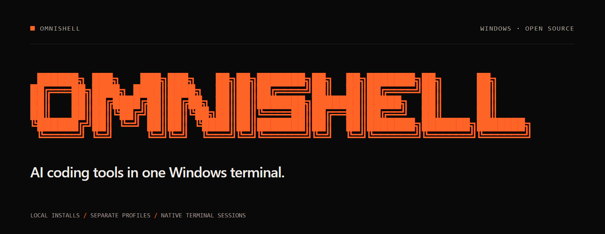
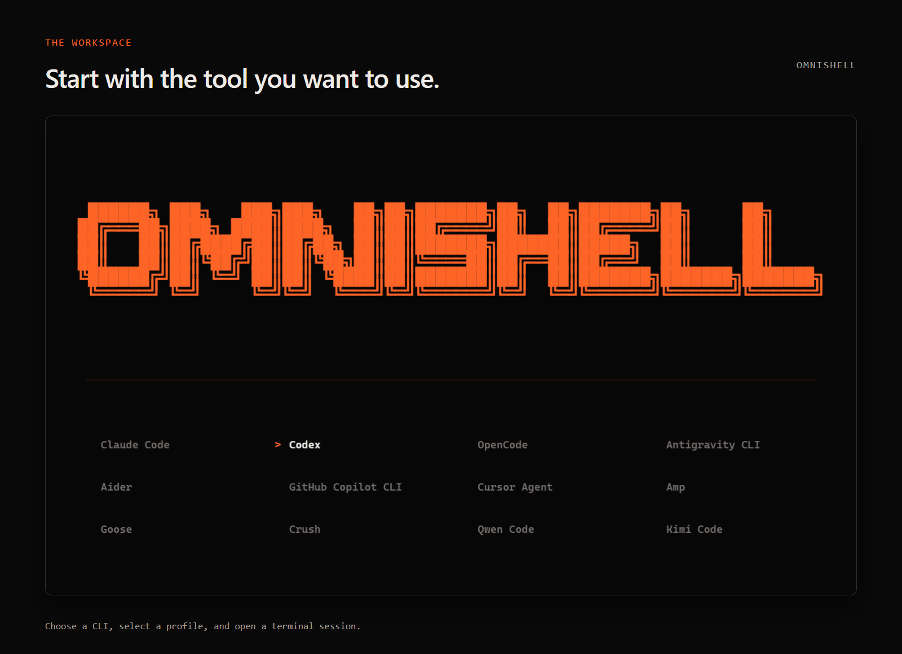
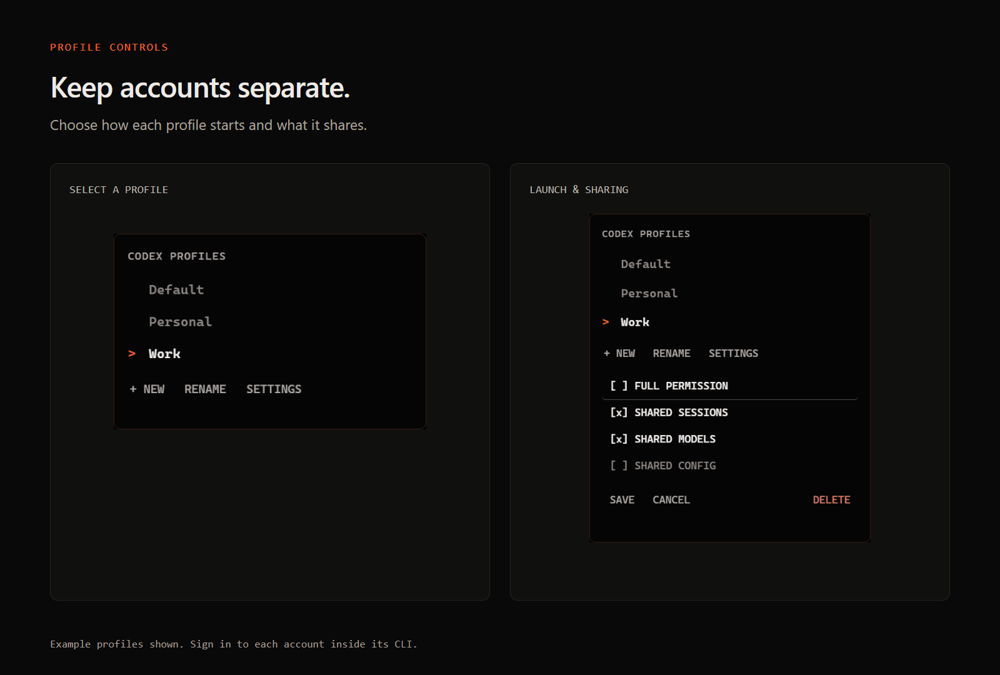

<p align="center">
  
</p>

<p align="center">
  <a href="https://github.com/Utku4836/OmniShell/releases/latest">Download for Windows</a> &nbsp; · &nbsp;
  <a href="#supported-tools">Supported tools</a> &nbsp; · &nbsp;
  <a href="#development">Build from source</a> &nbsp; · &nbsp;
  <a href="CONTRIBUTING.md">Contributing</a>
</p>

OmniShell is an open-source Windows desktop app for running AI coding CLIs. Choose a tool, create a profile, and sign in inside its terminal. You can keep personal and work accounts in separate local installations and switch between them from one interface.

Each custom profile has its own CLI runtime, credentials, configuration, and workspace. Terminal sessions use Windows ConPTY and xterm.js, with support for keyboard navigation, text selection, and clipboard shortcuts.

## Get started

Download **OmniShell.exe** from the [latest release](https://github.com/Utku4836/OmniShell/releases/latest). Run the portable executable, select a CLI, and confirm its installation. Then open a profile and sign in with the tool's own authentication flow.

You need Windows 10 or 11. CLI subscriptions and API access are separate from OmniShell.

The portable package is around 300–400 MB. It uses store compression to reduce the extraction work at startup. Release binaries are unsigned, so Windows SmartScreen may ask you to confirm the first launch.



## Profiles

Create a named profile for each account or workspace you want to keep separate. Each profile gets an independent CLI installation. Rename it without changing its storage path, or delete a custom profile by confirming a move to recoverable trash.

In **Settings**, you can choose:

| Setting | Behavior |
|---|---|
| **Full Permission** | Start the CLI with its unattended or approval-bypass option. Off by default. |
| **Shared Sessions** | Exchange session data with other opted-in profiles of the same CLI. |
| **Shared Models** | Exchange the tool's supported model metadata or cache. |
| **Shared Config** | Exchange the tool's supported configuration files. |



Sharing stays within one CLI family. A Codex profile can share with another Codex profile; it cannot share with Claude Code. Close a profile before opening another that uses the same shared category. Independent profiles can run at the same time.

OmniShell excludes dedicated authentication files from sharing. Some tools store API keys inside general configuration files, so enable Shared Config only when you intend to share those settings. Turning sharing off keeps the profile's current local copy.

**Full Permission bypasses the selected CLI's approval prompts.** Enable it only for profiles and workspaces you trust. Profile separation organizes local data; it is not an operating-system security sandbox. CLIs still run with your Windows account permissions.

## Supported tools

| Tool | Installation source |
|---|---|
| [Claude Code](https://github.com/anthropics/claude-code) | `@anthropic-ai/claude-code` |
| [Codex](https://github.com/openai/codex) | `@openai/codex` |
| [OpenCode](https://github.com/anomalyco/opencode) | `opencode-ai` |
| [Antigravity CLI](https://antigravity.google/docs/cli-install) | Official PowerShell installer |
| [Aider](https://aider.chat/docs/install.html) | Official PowerShell installer |
| [GitHub Copilot CLI](https://github.com/github/copilot-cli) | `@github/copilot` |
| [Cursor Agent](https://prod.cursor.com/docs/cli/installation) | Official Windows release |
| [Amp](https://ampcode.com/) | `@ampcode/cli` |
| [Goose](https://github.com/aaif-goose/goose) | Official Windows release |
| [Crush](https://github.com/charmbracelet/crush) | `@charmland/crush` |
| [Qwen Code](https://github.com/QwenLM/qwen-code) | `@qwen-code/qwen-code` |
| [Kimi Code](https://github.com/MoonshotAI/kimi-cli) | `@moonshot-ai/kimi-code` |

OmniShell resolves commands from the selected profile's runtime directory. Installers report progress in the interface and keep a local transcript for troubleshooting. An installation is marked ready only after OmniShell finds its expected executable.

## Keyboard and window controls

| Input | Action |
|---|---|
| Arrow keys or `J` / `K` | Navigate the tool grid |
| `Enter` | Confirm a choice or open the selected profile |
| `N` / `R` in the profile picker | Create or rename a profile |
| `S` in the profile picker | Open profile settings |
| `I` in the profile picker | Install the selected profile's CLI |
| `U` in the tool grid | Update or reinstall the selected CLI |
| `Ctrl+C` with selected text | Copy the selection |
| `Ctrl+V` or `Ctrl+Shift+V` | Paste into the terminal |
| Right-click | Open window and session actions |
| `Ctrl+Alt+S` | Hide or restore OmniShell |

**Switch CLI** opens a profile picker in the current window. **New Window** asks which profile to open. Closing a session returns the main window to the tool grid; auxiliary session windows close. `Esc` stays with the active CLI. After a CLI exits, press `Enter` to restart it.

## Local storage

Source builds use the repository's `system/` directory. Packaged builds use `%APPDATA%\OmniShell\system`, unless you set `OMNISHELL_SYSTEM_ROOT`.

```text
system/
├── _install/logs/              Installer transcripts
├── _profiles/
│   ├── profiles.json          Profile names and settings
│   └── trash/                 Recoverably deleted profiles
└── Codex/                     One directory per CLI family
    ├── .codex/                Default profile data
    ├── node_modules/          Default CLI installation
    ├── _shared/               Opt-in shared data
    └── profiles/p_<uuid>/
        ├── profile.json       Name, settings, and layout
        ├── runtime/           Independent CLI installation
        └── .codex/            Independent profile data
```

Profiles also receive separate HOME, AppData, XDG, and temporary directories. They start in neutral workspaces under `%APPDATA%\OmniShell\workspaces`, outside the application source tree. Deleting a custom profile moves its data to trash; the Default profile cannot be deleted.

## Development

Install Node.js 22.19 or newer, then clone the repository:

```powershell
git clone https://github.com/Utku4836/OmniShell.git
cd OmniShell
.\start.bat
```

The launcher installs the locked dependencies on first run. For development commands:

```powershell
cd app
npm ci
npm run check
npm test
npm run test:ui
npm run health
npm run dist
```

The UI smoke command uses temporary profiles and hidden Electron windows. The health command requires local CLI installations and checks their version commands through ConPTY. The portable build is written to `dist/`.

To regenerate the README artwork from the app's interface, run `npm run docs:assets` on Windows. The capture uses example profiles in a temporary directory and writes the images to `docs/images/`.

See [CONTRIBUTING.md](CONTRIBUTING.md) for development conventions and [SECURITY.md](SECURITY.md) for reporting a security issue.

## License

[MIT](LICENSE) · Utku4836
