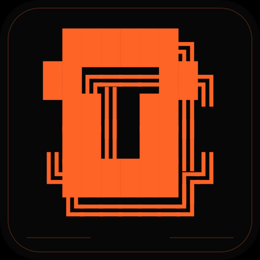
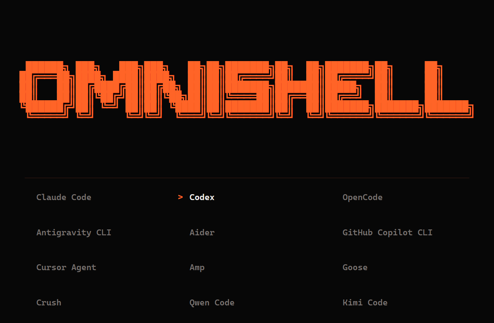
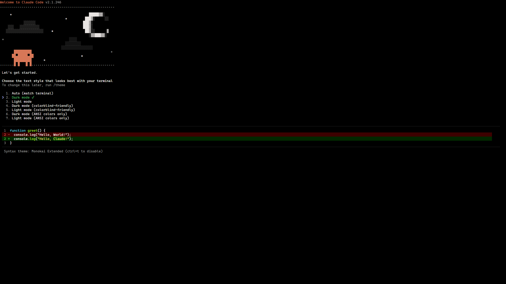

  

<h1 align="center">OmniShell</h1>

  Twelve AI coding CLIs. One fast Windows terminal.

  
  
  
  

OmniShell installs, opens, and isolates popular coding agents behind a single keyboard-friendly interface. Every custom profile gets its own CLI runtime, HOME, AppData, XDG directories, credentials, caches, configuration, and neutral workspace. Nothing silently falls back to a globally installed command.

## What it gives you

- **One terminal surface:** Real ConPTY sessions rendered by xterm.js with GPU acceleration.
- **Local profile installs:** Every command is resolved only from the selected profile's own runtime directory.
- **Explicit installation:** Select a missing CLI, then answer the inline <code>Install? YES NO</code> prompt.
- **Visible progress:** Download stages and byte-based transfers render as a live <code>#</code> percentage bar.
- **Named profiles:** Create and rename fully isolated accounts; custom profiles install independent binary/runtime trees.
- **Reliable Windows launch:** npm command wrappers, executable paths containing spaces, resize races, stale sessions, and process-tree cancellation are handled explicitly.
- **Predictable windows:** Switch CLI stays in the current window; New Window first asks which profile to open, and auxiliary windows close instead of becoming duplicate main menus.
- **Useful failures:** Install output is cleaned for the UI while the full transcript remains available locally.

## Interface

  
  

The main surface uses the same ANSI Shadow lettering as the bundled icon. It has no blurred glow or decorative HUD. Selecting an installed CLI opens a compact profile picker where a named account can be opened, created, or renamed. The context menu shares the exact background, font, border, and accent tokens used by the main screen.

## Included CLIs

| Tool | Local installation source | Command |
|---|---|---:|
| [Claude Code](https://github.com/anthropics/claude-code) | <code>@anthropic-ai/claude-code</code> | <code>claude</code> |
| [Codex](https://github.com/openai/codex) | <code>@openai/codex</code> | <code>codex</code> |
| [OpenCode](https://github.com/anomalyco/opencode) | <code>opencode-ai</code> | <code>opencode</code> |
| [Antigravity CLI](https://antigravity.google/docs/cli-install) | Official PowerShell bootstrap | <code>agy</code> |
| [Aider](https://aider.chat/docs/install.html) | Official PowerShell bootstrap | <code>aider</code> |
| [GitHub Copilot CLI](https://github.com/github/copilot-cli) | <code>@github/copilot</code> | <code>copilot</code> |
| [Cursor Agent](https://prod.cursor.com/docs/cli/installation) | Official native Windows release | <code>cursor-agent</code> |
| [Amp](https://ampcode.com/) | <code>@ampcode/cli</code> | <code>amp</code> |
| [Goose](https://github.com/aaif-goose/goose) | Official Windows GitHub release | <code>goose</code> |
| [Crush](https://github.com/charmbracelet/crush) | <code>@charmland/crush</code> | <code>crush</code> |
| [Qwen Code](https://github.com/QwenLM/qwen-code) | <code>@qwen-code/qwen-code</code> | <code>qwen</code> |
| [Kimi Code](https://github.com/MoonshotAI/kimi-cli) | <code>@moonshot-ai/kimi-code</code> | <code>kimi</code> |

OmniShell installs the CLI programs, not their subscriptions or API access. Authentication still happens inside each tool.

## Download

Download **OmniShell.exe** from the [latest release](https://github.com/Utku4836/OmniShell/releases/latest) and run it. It is a portable executable; there is no setup wizard and no system-wide tool installation.

The release intentionally uses a larger, store-compressed portable package. The download is roughly 300–400 MB, but startup is much faster because Windows does not need to heavily decompress the Electron runtime on every cold launch.

> [!NOTE]
> Release binaries are currently unsigned. Windows SmartScreen may ask you to confirm the first launch.

### Run from source

Requirements: Windows 10/11 and Node.js 22.19 or newer.

~~~powershell
git clone https://github.com/Utku4836/OmniShell.git
cd OmniShell
.\start.bat
~~~

The launcher installs the locked Electron dependencies on first run and then starts OmniShell.

## Controls

| Input | Action |
|---|---|
| Arrow keys or <code>J</code> / <code>K</code> | Move through the CLI grid |
| <code>Enter</code> | Confirm install or open the selected CLI's profile picker |
| <code>N</code> / <code>R</code> in the profile picker | Create or rename a profile |
| <code>I</code> in the profile picker | Install the selected profile's isolated CLI runtime |
| <code>U</code> | Start update/reinstall for the selected CLI |
| <code>Esc</code> | Pass through to the active CLI |
| <code>Enter</code> after a CLI exits | Restart the same CLI |
| <code>Ctrl+C</code> with a selection | Copy selected terminal text |
| <code>Ctrl+V</code> or <code>Ctrl+Shift+V</code> | Paste text into the active PTY |
| Right-click | Open the minimal action menu |
| <code>Close &lt;CLI&gt;</code> in the terminal menu | Return to the main window, or close an auxiliary CLI window |
| <code>Ctrl+Alt+S</code> | Hide or restore OmniShell |

## Isolation model

~~~text
system/
├── _install/
│   └── logs/                  full installer transcripts
├── _profiles/
│   └── profiles.json          names mapped to stable profile IDs
├── ClaudeCode/
│   ├── .claude/               Claude profile
│   ├── node_modules/          local CLI package
│   └── Temp/
├── Codex/
│   ├── node_modules/          backward-compatible Default runtime
│   ├── .codex/                backward-compatible Default profile
│   └── profiles/
│       └── p_<uuid>/
│           ├── profile.json   readable name and layout descriptor
│           ├── runtime/       independent CLI binary/package
│           ├── .codex/        independent credentials/config
│           ├── AppData/       independent Windows application data
│           └── Temp/          independent temporary files
└── KimiCode/
    └── .kimi-code/            Default Kimi profile
~~~

Provider secrets and global CLI profile variables are not copied into child environments. Each profile starts in <code>%APPDATA%\OmniShell\workspaces\&lt;tool&gt;\&lt;profile&gt;</code>, outside the source/runtime tree, so a CLI does not accidentally inherit OmniShell's Git branch. Aider also runs with Git discovery disabled in its empty profile.

> [!IMPORTANT]
> Profile isolation is not an operating-system security sandbox. A launched CLI still runs with your Windows account permissions and can access files or the network when you direct it to do so.

## Installer guarantees

1. Build a trusted install plan from the static tool registry.
2. Download into a <code>.partial</code> file when a remote asset is involved.
3. Report real byte progress when the server exposes a content length.
4. Keep one active installer per tool/profile pair; other windows subscribe to that exact job.
5. Verify the expected executable inside the isolated directory.
6. Reject a zero exit code when the command is still missing.
7. Preserve the complete profile-specific log under <code>system/_install/logs/</code>.

Cursor's official bootstrap is parsed only to resolve its current release. OmniShell downloads and extracts the release itself, avoiding the bootstrap's user-PATH mutation.

## Performance work

The runtime includes verified optimizations that do not change tool behavior:

- constant-time tool lookup maps in the main and renderer processes;
- lazy creation of per-tool directory trees;
- one-pass installer-log discovery with an in-memory cache;
- 64 KiB buffered log writes instead of synchronous writes per chunk;
- coalesced and deduplicated installer IPC;
- 8 ms / 64 KiB PTY output batching;
- keyed incremental row rendering;
- animation-frame batching for DOM state and install progress;
- delegated grid event handlers;
- resize-observed, single-frame terminal fitting;
- lazy xterm creation;
- GPU WebGL rendering with context-loss fallback;
- CSS layout/paint containment;
- bounded terminal query and output buffers.

## Development

~~~powershell
cd app
npm ci
npm run check
npm run health   # requires all CLIs to be installed locally
npm run dist
~~~

<code>npm run check</code> validates the JavaScript sources used by the main process, preload bridge, renderer, installers, terminal query handling, and health command. Windows CI also parses every PowerShell installer and builds the portable executable.

<code>npm run health</code> starts every installed CLI through the same ConPTY path OmniShell uses and verifies its <code>--version</code> command.

## Repository layout

~~~text
app/
├── assets/       icon, tray image, and bundled font license
├── lib/          tool registry, installer runtime, PTY helpers
├── renderer/     minimal interface and xterm surface
└── scripts/      trusted Windows installers and the ConPTY health command
docs/             verified application screenshots
system/           ignored runtime profiles and downloads
~~~

## License

[MIT](LICENSE) © 2026 Utku4836
